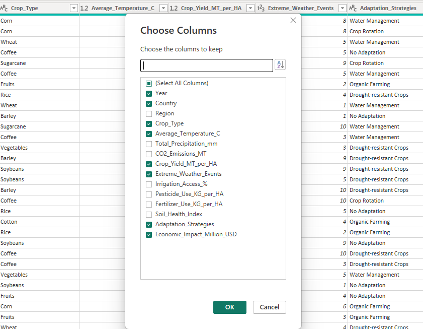

# A Comparative Climate Adaptation Study between Nigeria and the United States
This project is intended at comparing the impact of climate change on agricultural economies of Nigeria and the United States. 

## Objective
This project aims to: 
- **Identify the key factors driving economic losses related to climate impacts**
- **Determine which crops are most vulnerable to climatic changes.**
- **Evaluate the effectiveness of various climate adaptation strategies (e.g., water management, drought-resistant crops)**
- **Compare climate risks and adaptation outcomes between Nigeria and the United States.**
- **Assess whether successful adaptation strategies in one country (e.g., Nigeria) can be effectively transferred and applied in another context (e.g., the United States)**
---
## Methodology
### **Data Source and Import**
- **Data Source:** Climate and agricultural datasets obtained from Kaggle.
- **Data Preparation:** Power Query was used to clean, preprocess, and transform the raw data for analysis.
- **Data Analysis:** Key metrics and insights were generated using DAX measures within Power BI.
- **Visualization:** Interactive dashboards were built in Power BI to present findings clearly and effectively.

---
## Data Filtering in Power Query
The dataset was refined to focus specifically on the two countries central to the study: Nigeria and the United States. Additional filtering was applied to retain only the columns relevant to the project objectives:
- Year
- Country
- Crop_Type
- Average_Temperature_C
- Crop_Yield_MT_per_HA
- Extreme_Weather_Events
- Adaptation_Strategies
- Economic_Impact_Million_USD

These selections ensured that the analysis remained aligned with the study’s comparative focus and allowed for clear insight into climate impacts, crop vulnerability, and adaptation strategies across both countries. 




---

## Repository Structure
```
📁 Climate-Change-Impact-on-Agriculture/
│
├── 📄README.md
├── 📁 documentation/
│    ├── model-overview.md
|    ├── data-sources.md
|    └─  dax-measures.md 
├── 📁 pbix/
│    └─ report.pbix
└─  📁 assets/
     └─ (screenshots, diagrams)                     
```
---
