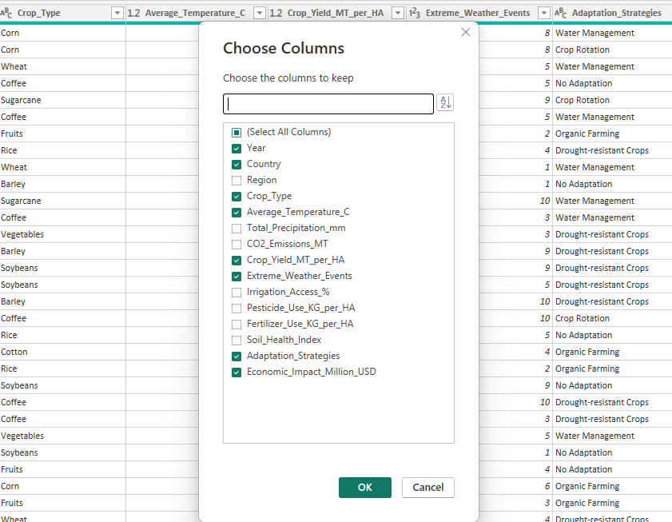
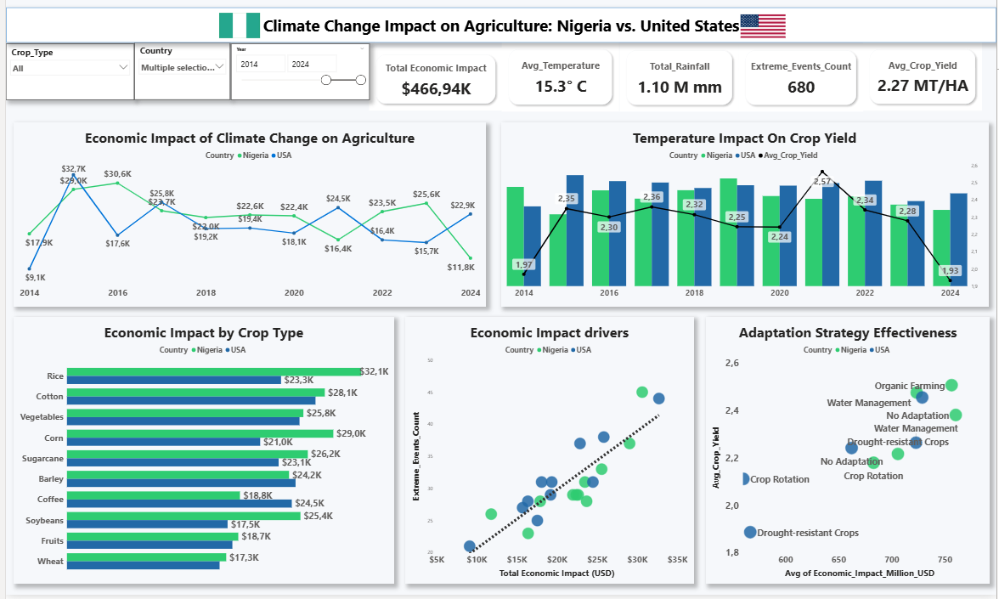

# A Comparative Climate Adaptation Study between Nigeria and the United States
This project is intended at comparing the impact of climate change on agricultural economies of Nigeria and the United States. 

## Objective
This project aims to: 
- **Identify the key factor driving economic losses in agriculture**
- **Determine which crops are most vulnerable to climatic changes.**
- **Evaluate the effectiveness of various climate adaptation strategies (e.g., water management, drought-resistant crops)**
- **Compare climate risks and adaptation outcomes between Nigeria and the United States.**
- **Assess whether successful adaptation strategies in one country (e.g., Nigeria) can be effectively transferred and applied in another context (e.g., the United States)**
---
## Methodology
### 1. **Data Source and Import**
The dataset used in this project contains climate and agricultural data of various countries. It was sourced from Kaggle and imported into Power Query from a locally stored Excel file.
  
### 2. **Data Preparation**  
Power Query was used to clean, preprocess, and transform the raw data for analysis.

**Data Filtering in Power Query:**

The dataset was refined to focus specifically on the two countries central to the study: **Nigeria** and **the United States**. Additional filtering was applied to retain only the columns relevant to the project objectives:
- Year
- Country
- Crop_Type
- Average_Temperature_C
- Crop_Yield_MT_per_HA
- Extreme_Weather_Events
- Adaptation_Strategies
- Economic_Impact_Million_USD

These selections ensured that the analysis remained aligned with the study’s comparative focus and allowed for clear insight into climate impacts, crop vulnerability, and adaptation strategies across both countries. 



### 3. **Data Analysis**  
DAX measures were created to support the analysis of crop performance, climate trends, and economic impacts across **Nigeria** and **the United States**. These measures calculate key metrics such as average crop yield, total economic losses, extreme weather event counts, and temperature insights. They form the foundation of the visualizations and enable meaningful comparisons between both countries. Refer to  [documentation/dax-measures.md](documentation/dax-measures.md) for a list of all measures. 

 ---
 
## Insights

<!--  -->

### **Broad Overview**
- The two countries over this recent decade  (2014 - 2024) recorded a total financial loss of about 466 thousand dollars.
- This loss was driven by over 680 Extreme Weather Events that were recorded across the two nations.But  Despite these challenges, the average farmer managed to achieve an average crop yield of 2.27 metric tons per hectare.
- For the United States, the most economic losses were recorded in the year 2015 and Nigeria experienced a huge economic impact during the year 2016 and there's been a decline in the previous year 2024
  


### **What is the key factor driving economic losses?**


- There is a positive correlation between Extreme Weather Events and Econimic losses. As the number of extreme weather events increase, so do the magnitude of economic losses, thereby confirming Extreme Weather Events as one of the key drivers of financial loss in the agricultural sector

### **which crops are most vulnerable to climatic changes**

For Nigeria Rice, Corn and Cotton are among crops that are likely to result in huge losses
 and for the US that would be Cotton, Vegetables and Barley.

### **Which adaptation strategies work best for each country?**

- For Nigeria: the top performing strategy is Water Management. It gives Nigerian farmers the highest yields and the best protection against financial loss. 

- For the USA: the top performing strategy  is Crop Rotation. This practice works well by delivering great yields for the lowest average financial impact.

- It was interesting to note that Water Management  seemed to work well for both countries, making it a transferable strategy that works across different countries that have very different climates and economic systems. 


## Conclusions & Recommendations
- Crop types that are most vulnerable should be prioritised for research as they are responsible for major  economic losses
- Extreme weather events are the main driver of financial loss in agricultural settings and as a result any policies or adaptation strategies that can reduce the frequency of these events or mitigate their damage will reduce financial losses. 
- Adaptation Strategies can be  Context-Specific for example While the USA saw the best results with Crop Rotation, Nigeria achieved the best results from Water Management. So sometimes solutions need to be tailored to specific circumstances of the country.

---

## Repository Structure
```
📁 Climate-Change-Impact-on-Agriculture/
│
├── 📄README.md
├── 📁 documentation/
│    ├── model-overview.md
|    ├── data-sources.md
|    └─  dax-measures.md 
├── 📁 pbix/
│    └─ report.pbix
└─  📁 assets/
     └─ (screenshots, diagrams)                     
```
---
